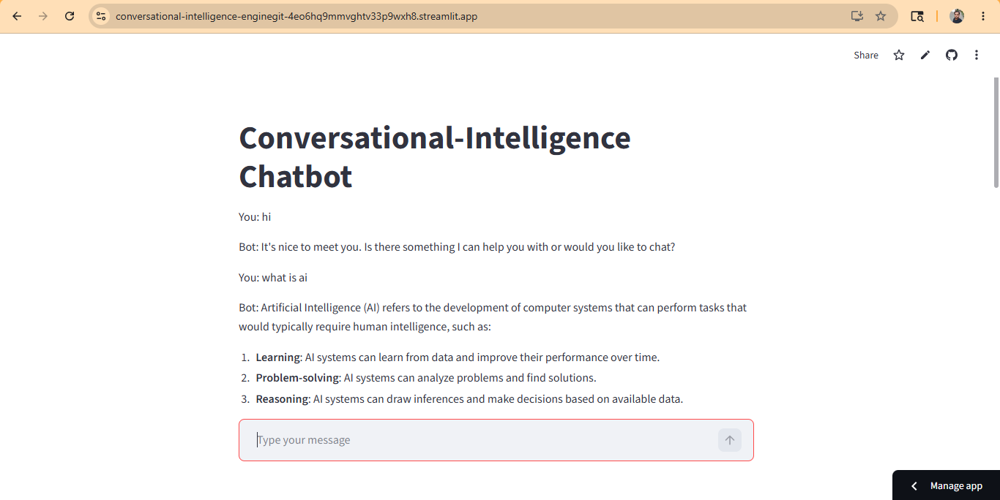

# Conversational Intelligence Engine

## Overview

A context-aware conversational AI system built using LangChain, Groq LLM, FastAPI, and Streamlit.

Unlike a stateless chatbot, the system maintains recent conversation history using conversational memory, enabling more natural and coherent interactions across multiple turns.

The project is deployed with:

- FastAPI backend API
- Streamlit frontend interface
- Groq-powered LLM inference
- Memory-aware conversation handling

---

## Features

- Context-aware conversation
- Conversation memory
- Multi-turn interaction support
- Previous interaction awareness
- FastAPI backend
- Streamlit frontend
- Edge-case handling:
    - Empty input
    - Repeated queries
    - Invalid input

---

## Tech Stack

- Python
- LangChain
- Groq API
- FastAPI
- Streamlit

---

## System Architecture

User Query  
↓  
Streamlit Frontend  
↓  
FastAPI API  
↓  
Load Conversation Memory  
↓  
Prompt Construction  
↓  
Groq LLM  
↓  
Generate Contextual Response  
↓  
Update Memory

---

## Project Structure

```text
Conversational-Intelligence-Engine/
│
├── chatbot.py
├── api.py
├── app.py
├── requirements.txt
├── README.md
├── screenshots/
└── docs/
```

---

## Installation

Clone repository:

```bash
git clone https://github.com/yourusername/Conversational-Intelligence-Engine.git
```

Move into directory:

```bash
cd Conversational-Intelligence-Engine
```

Install dependencies:

```bash
pip install -r requirements.txt
```

---

## Environment Variables

Create a `.env` file:

```text
GROQ_API_KEY=your_api_key
```

---

## Run FastAPI Backend

```bash
uvicorn api:app --reload
```

Backend runs at:

```text
http://127.0.0.1:8000
```

---

## Run Streamlit Frontend

```bash
streamlit run app.py
```

---

## Deployment

Frontend:

YOUR_STREAMLIT_URL

Backend:

YOUR_RENDER_URL

---

## Demo




---

## Example

User:

What is machine learning?

Bot:

Machine learning is a branch of artificial intelligence that enables systems to learn patterns from data and improve performance without explicit programming.

---

## Design Decisions

- Implemented conversation memory for contextual continuity
- Added memory windowing to preserve recent interactions
- Limited memory size for efficiency
- Used FastAPI to separate backend and inference logic
- Used Streamlit for lightweight frontend deployment
- Included input validation and edge-case handling

---

## Future Improvements

- Multi-user conversation support
- Authentication
- Persistent memory storage
- Database-backed chat history
- Long-term memory support
- Voice interaction support
